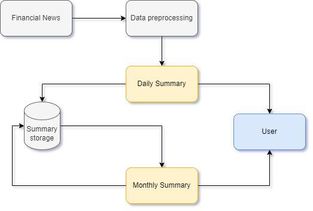
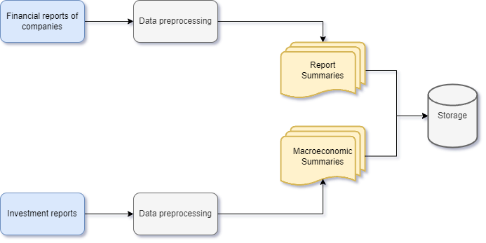

# agents4predictions

## Domain-specific Task

Наша команда решает задачу по созданию сервиса в области финансового консалтинга с применением LLM.

Предполагаемый сервис предназначен для принятия решений индивидуальными инвесторами или командой трейдеров, которые включают отслеживание последних событий в отдельных компаниях или ее секторе (с помощью сводки новостей), анализа финансовой отчетности (с помощью сводки фундаментальных показателей), проведения макроэкономического анализа. 

Ключевая задача: сделать принятие решений по приобретению или продаже того или иного актива более простым и обоснованным для инвесторов и трейдеров.

P.S.
На первом этапе мы рассматриваем классическую биржу MOEX с акциями публичных компаний. 
В качестве факторов влияния ключевым считаем новостную повестку (посты в социальных сетях) 

### Определение проблемы
* Индивидуальные инвесторы - cлишком большое количество информации, которую нужно регулярно анализировать.

* Трейдеры - нехватка времени для принятия обоснованных инвестиционных решений в средне/долгосрочной перспективе.

### Обзор актуальных задач

На основе анализа научных работ и статей был составлены ряд актуальных задач в домене финансов и LLM, среди которых:

* Использование готовых LLM для полного цикла задач, связанных с RAG новостной повестки, анализом отчетов и финансовых показателей, таких как FinMA 7B, FinGPT, и FinLLaMa.

* Обучение собственной модели - данная задача может требовать значительных ресурсов, что потенциально делает конкуренцию с крупными моделями, такими как BloomBergGPT или XuanYuan2.0, сложной задачей.

* Наличие возможности дообучения моделей (наиболее релевантно для адаптации модели на русский язык) с относительно небольшим бюджетом. Например, дообучение FinGPT может обойтись менее чем в 1000$.

* В основу ключевых концепций в работе сервиса могут стать модели BizBench и BioFinBERT, а также исследования, касающиеся прогнозирования динамики активов и сентимент-анализа на основе текстовых данных.

* Необходимость более детально исследовать примеры, демонстрирующие, как NER & Sentiment модели могут использоваться для анализа настроений в финансовом секторе и извлечения полезной информации (феномен wallstreetbets, заявление Илона Маска в X (ex-Twitter) и др.).

* Важно рассмотреть подходы и возможности методов алгоритмической торговли и предсказания котировок в реальном времени, не связанных с LLM, но с возможностью привязке их к агентам (важность исследования heterogeneous multi-agent discussion и других особенностях взаимодействия LLM-агентов между собой).

### Выбор LLM

|  | Training a model from scratch| Additional training | Using General LLMs |
|-------------|-------------|-------------|-------------|
| Requires a lot of resources | ✓  | - |  - |
| Suitable for working   with sensitive data | ✓  |  ✓ |  - |
| Requires a large   amount of domain data | ✓ | ✓ | - |

## Data Complexity

### Какие данные мы собираем

* Финансовая отчетность и аналитические материалы компаний - для сбора отчетности предполагается использование API. Аналитические материалы планируется собирать вручную (n раз за год).
* Собираем с помощью API социальных сетей (VK, Telegram) и парсинга Тинькофф Пульс и Профит от БКС.
* Данные московской фондовой биржи - собираем с помощью API MOEX.

### Основные трудности работы с данными:
* Гетерогенность - временные рядя, финансовые показатели из текстов, тексты новостей и постов в соцсетях.

* Сложность интерпретации данных для LLM моделей (особенно в части computing и работы с числовыми показателями и RAG для большого количества текстов).

### Собранный датасет

Для выявления взаимосвязи новостной повестки нам необходимо анализировать как показатели определенных тикеров (краткое название котируемых инструментов (акций, облигаций, индексов)), так и оценить фактор влияния на эти показатели.

Для исторического анализа нами были собраны данные со следующих источников:

* БКС Мир инвестиций
* Forbes
* РБК Инвестиции
* ВТБ Мои Инвестиции
* Inc. Russia
* Тинькофф Инвестиции
* Investing.com
* Коммерсантъ Экономика
* Банк России
* СберИнвестиции
* MOEX - Московская биржа
* ДОХОДЪ
* Alfa Wealth

[Сырые данные](data/raw) / [Подготовленные данные](data/final) 

## Оценка качества данных

### Подготовленный датасет (final):

|  | Column| Non-Null Count | Dtype |
|---|--------|----------------|---------|
| 0 | date   | 34856 non-null  | object |
| 1 | text   | 34856 non-null  | object |
| 2 | source | 34856 non-null  | object |

### Исходный датасет (raw):
|  | Column | Non-Null Count | Dtype   |
|--|--------|----------------|---------|
| 0 | date  | 35878 non-null |  object |
| 1 | text  | 34856 non-null |  object |
| 2 | source | 36069 non-null | object |

## Solution

Для прототипа, который в настоящий момент нацелен на сопоставление дискурса и динамики цен, у нас реализован следующий пайплайн:
1. Получаем финансовые данные компании по тикеру с MOEX
2. Выбираем время, за которое получаем данные
3. Имплементируем RAG задачу по саммаризации и выдивжения предположений относительно тикера на основе текствой инфорамции (в настоящий момент мы получаем данные в режиме рельного времени с Тинькофф Инвестиции (Пульс))

## Потенциальный workflow проекта

### General pipeline

### Potential expanding pipeline with data

## Команда

* Виталий Карташов (ИИ)
* Даниил Тимофеев (ИИ)

## Cписок источников

* BizBench: A Quantitative Reasoning Benchmark for Business and Finance (Nov. 2023)
* Data-Centric Financial Large Language Models (Oct. 2023)
* Shai: A large language model for asset management (Jan. 2024)
* Forecasting Cryptocurrency Prices Using Deep Learning: Integrating Financial, Blockchain, and Text Data (Nov. 2023)
* Can Large Language Models Beat Wall Street? Unveiling the Potential of AI in Stock Selection (Jan. 2024)
* Pre-trained Large Language Models for Financial Sentiment Analysis (Oct. 2023)
* A Comparative Analysis of Fine-Tuned LLMs and Few-Shot Learning of LLMs for Financial Sentiment Analysis (Dec. 2023)
* Designing Heterogeneous LLM Agents for Financial Sentiment Analysis (Jan. 2024)
* Conversational Financial Information Retrieval Model (ConFIRM) (Oct. 2023)
* Numerical Reasoning for Financial Reports (Dec. 2023)

